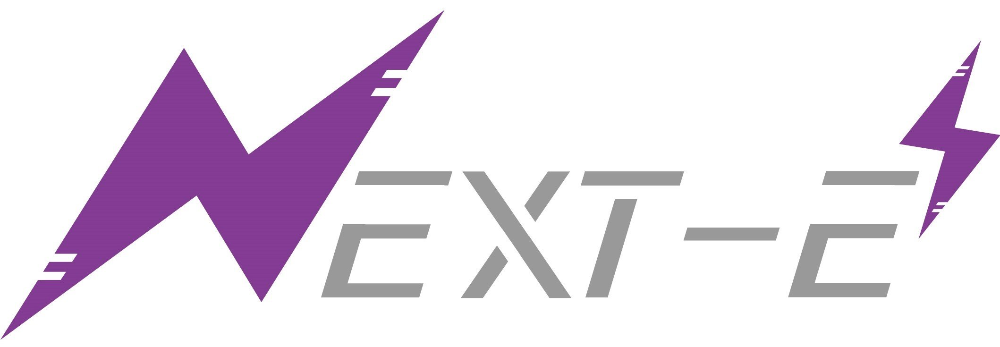

    

<h1 align="center">欢迎报名NEXT-E战队电控组！</h1>

## 信息发布栏

**电控组 招新 QQ群：** 577651850

**实验室地址：** 工训中心2-305

**联系人：** 不用列出来了哦有事在群里公屏打出来就好私聊群主管理也行

## 关于我们

我们是NEXT-E战队电控组，由对嵌入式编程、电子技术和控制理论感兴趣的同学组成。一个赛场上的机器人**需要拥有躯体、可以行动、会感知决策**，嵌入式组的责任就是搭建电路、编写控制程序，让机器人拥有行动能力。

日常工作主要围绕下面这几项技术开展：

- 单片机编程
- 控制算法、仿真
- 功率电子设计（电容）
- PCB 设计

在每个赛季的备赛过程中，我们会并行进行开发和研发两条线，既利用已经掌握的技术造出本赛季要上场的机器人，也学习探索新技术，不断进步迭代;

不管你选择帮助我们造车，还是做一些研究性的贡献，电控组都会是一个绝佳的实践平台，提供你作为个人难以获得的资源。

## 入队考核

相信大家一定会在我们的团队里发挥才能，也会在这里结识志同道合的朋友！但为了确保你能胜任我们的工作，需要完成一些考核任务才能入队；

如果觉得自己的知识有漏洞也不用担心，部分任务的文档里会包含一些参考资料，以便大家学习相关的知识点。希望大家发挥自学能力和信息检索能力，独立完成这些任务。如果遇到自己实在解决不了的问题，可以在群里提问交流。

#### 考核1

截止时间：**_2024年11月10日_**

内容：**绘制一个降压电路/用32写一个呼吸灯程序/编写冒泡排序并通过git提交**（以上三个任务任选其一即可）

你应该掌握的：

>**1. C语言基本语法（期末考试要求）。**
>
>**2.hal库开发，定时器输出PWM。**
>
>**3. 基本PCB绘制，嘉立创eda的使用，白嫖打样。**
>
>**4. git、github的基本使用。**

[任务一](tasks/1.pcb/README.md)	[任务二](/tasks/2.pwm/README.md)	[任务三	](tasks/3.c/README.md)

